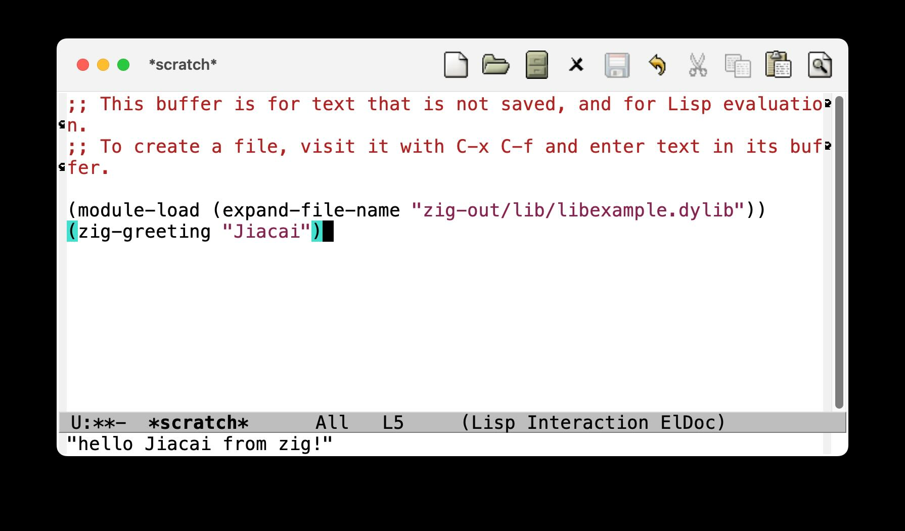

#+TITLE: Zig-emacs
#+DATE: 2023-12-24T12:27:53+0800
#+LASTMOD: 2026-05-07T21:24:21+0800
#+OPTIONS: toc:nil num:nil

[[https://github.com/jiacai2050/zig-emacs/actions/workflows/ci.yml][https://github.com/jiacai2050/zig-emacs/actions/workflows/ci.yml/badge.svg]]
[[https://github.com/jiacai2050/zig-emacs/actions/workflows/lisp-ci.yml][https://github.com/jiacai2050/zig-emacs/actions/workflows/lisp-ci.yml/badge.svg]]
[[https://img.shields.io/badge/zig%20version-0.16.0-blue.svg]]

Zig binding for Emacs's [[https://www.gnu.org/software/emacs/manual/html_node/elisp/Writing-Dynamic-Modules.html][dynamic modules]].

* Docs

See https://jiacai2050.github.io/zig-emacs/

* Example
#+begin_src zig
const std = @import("std");
const emacs = @import("emacs");

// Every module needs to call `module_init` in order to register with Emacs.
comptime {
    emacs.module_init(@This());
}

fn add(e: emacs.Env, v1: emacs.Value, v2: emacs.Value) emacs.Value {
    const a = e.extractInteger(v1);
    const b = e.extractInteger(v2);
    return e.makeInteger(a + b);
}

// Emacs dynamic module entrypoint
pub fn init(env: emacs.Env) c_int {
    env.makeFunction(
        "zig-add",
        add,
        // This make `zig-add` interactive.
        .{ .interactive_spec = "nFirst number: \nnSecond number: " },
    );

    return 0;
}
#+end_src
Compile [[file:example.zig][this example]] with ~zig build~, then load it into Emacs.
#+BEGIN_SRC emacs-lisp

(module-load (expand-file-name "zig-out/lib/libzig-example.dylib"))
(zig-greeting "Jiacai")
#+END_SRC
If everything is OK, you should see our greeting message in minibuffer.

* Usage
=zig-emacs= support Zig's [[https://ziglang.org/download/0.16.0/release-notes.html][package manager]].

#+begin_src bash
# Latest version
zig fetch --save git+https://github.com/jiacai2050/zig-emacs.git

# Tagged version
zig fetch --save git+https://github.com/jiacai2050/zig-emacs.git#v0.1.0
#+end_src

* License
[[./LICENSE][MIT]]
